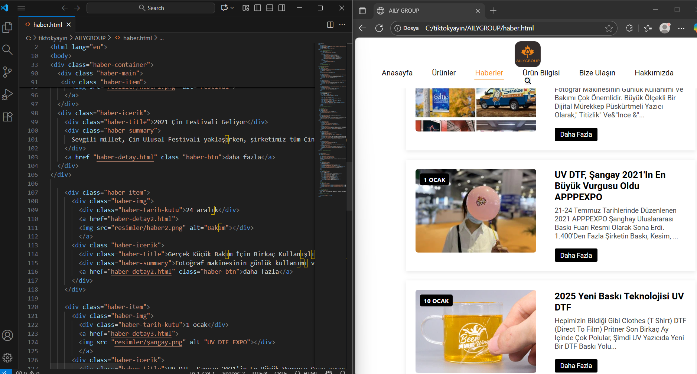

# Web Site Projesi

Bu proje, HTML ve CSS kullanılarak oluşturulmuş basit bir web sitesidir.  
Sayfa yapısı, modern bir tasarım anlayışıyla hazırlanmıştır.  
Projede responsive (mobil uyumlu) yapı ve temel HTML semantik kuralları uygulanmıştır.

## 🚀 Canlı Görüntüle
[👉 Projeyi canlı görüntüle](https://aslhanuznx.github.io/web-site/)

## 🛠 Kullanılan Teknolojiler
- HTML5  
- CSS3  
- JavaScript 

## 📸 Ekran Görüntüsü

## 💡 Geliştirme Notları
- Responsive yapı eklendi  
- Renk paleti sadeleştirildi  
-  Animasyonklar eklendi.
